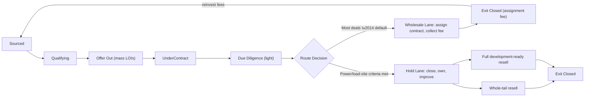

# Funnel Overview — Two Lanes, One Pipeline

Every prospect moves through the same front half of the funnel. Only after light due
diligence does a deal split into one of two lanes: **Wholesale Lane** (the default —
fast, no capital, assignment fee) or **Hold Lane** (rare — capital-intensive, held for a
bigger exit).

## Stage-by-stage, mapped to the existing `dealStage` field

The app's `dealStage` field (`packages/twenty-apps/re-acquisition/src/fields/opportunity-deal-stage.field.ts`)
already has every stage this funnel needs. Nothing new has to be added to run this
playbook today.

| `dealStage` value | What's happening | Who's involved |
|---|---|---|
| `SOURCED` | New landowner lead enters the CRM (list pull, inbound, driving-for-dollars) | Acquisitions rep |
| `QUALIFYING` | Confirm ownership, pull county parcel data, gauge motivation | Acquisitions rep |
| `OFFER_OUT` | LOI sent — usually part of a batch of many offers sent that week | Acquisitions rep |
| `UNDER_CONTRACT` | Seller signed; contract price and terms locked | Acquisitions rep |
| `DUE_DILIGENCE` | Light DD only: title check, basic survey/GIS, access, utility proximity | Acquisitions rep |
| **Route decision** *(see below)* | Deal is tagged for Wholesale Lane or Hold Lane | Deal owner + principal |
| `ACQUIRED` | Wholesale Lane: equitable interest secured, shopping to buyers list. Hold Lane: deal actually closes | Disposition |
| `DISPOSITION` | Wholesale Lane: assigning contract to a cash buyer. Hold Lane: entitlement/prep work before resale | Disposition |
| `EXIT_CLOSED` | Assignment fee collected (Wholesale Lane) or sale to whole-tail/developer buyer closes (Hold Lane) | Disposition |
| `DEAD` | Seller declined, deal didn't pencil, or lost to another buyer | Acquisitions rep |

`dealType` should always include `LAND`, plus `WHOLESALE` for lane-1 deals or the
relevant category once a Hold Lane deal is ready to resell.

## Why two lanes, not one

Wholesaling needs no capital and pays now — that's what builds the war chest. Buying and
holding needs capital and pays later, but pays much more per deal when the exit buyer is
a power-generation or large-load developer instead of a retail land buyer. Running both
off the same intake keeps the top of the funnel wide (every lead is worth qualifying)
while keeping company risk concentrated in only the parcels worth the wait — see
[06-buy-and-hold-criteria.md](06-buy-and-hold-criteria.md) for the routing rubric.

## Default assumption: wholesale it

Unless a parcel clears the Hold Lane bar, assume it gets wholesaled. Wholesaling first is
not a fallback — it is the primary strategy until the reinvestment loop
([07-capital-reinvestment-loop.md](07-capital-reinvestment-loop.md)) has generated enough
fee income to fund buy-and-hold deals without slowing down deal volume.
