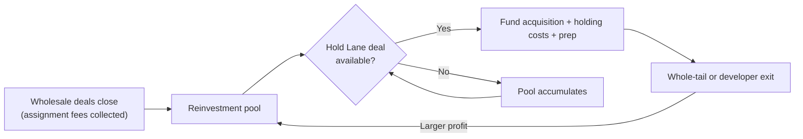

# Capital Reinvestment Loop

This is the mechanism that turns a wholesale business into a land-holding business
without raising outside capital. Assignment fees earned in the Wholesale Lane are the
fuel for Hold Lane acquisitions.

## The three phases

### Phase 1 — Build the pool (wholesale-only)

At the start, every deal is wholesaled. There is no capital to hold land yet, so there's
no decision to make — 100% of qualifying deals go through
[05-wholesale-disposition-playbook.md](05-wholesale-disposition-playbook.md). Every
assignment fee goes into the reinvestment pool, not into scaling personal draw or
overhead, until the pool covers at least one full Hold Lane acquisition plus its holding
costs and prep budget with a margin of safety.

### Phase 2 — Selective holding

Once the pool covers a Hold Lane deal comfortably, start applying
[06-buy-and-hold-criteria.md](06-buy-and-hold-criteria.md) to route the best-fitting
parcels into the Hold Lane instead of wholesaling them. Keep wholesaling everything else
— the pool needs to keep refilling faster than it's being spent, especially since Hold
Lane deals take months to exit versus days/weeks for wholesale deals.

### Phase 3 — Compounding

As Hold Lane exits close (whole-tail or power/load developer sales), their profit is
larger per deal than a wholesale fee — it flows back into the pool and funds either more
Hold Lane deals or a higher wholesale offer volume (more marketing spend, more list
pulls, more staff). The wholesale funnel keeps running underneath this the whole time —
it never turns off, because it's still the fastest, most reliable source of new cash and
the origination engine for every Hold Lane deal in the first place.

## Guardrails

- **Never starve the wholesale pipeline to fund a hold.** If pulling capital for a Hold
  Lane deal would stop marketing spend or list pulls, don't do it yet — grow the pool
  more first.
- **Don't hold more deals than the pool can carry for the full expected timeline.**
  Underwrite holding costs for the worst-case exit date, not the best case.
- **Reserve a buffer.** Keep enough of the pool liquid to cover 1–2 wholesale-cycle
  months of operating costs before committing the rest to a hold.
- **Track the reinvestment rate.** See [kpi-dashboard.md](kpi-dashboard.md) for the
  target metric (% of trailing-90-day assignment fee income committed to Hold Lane
  acquisitions).
